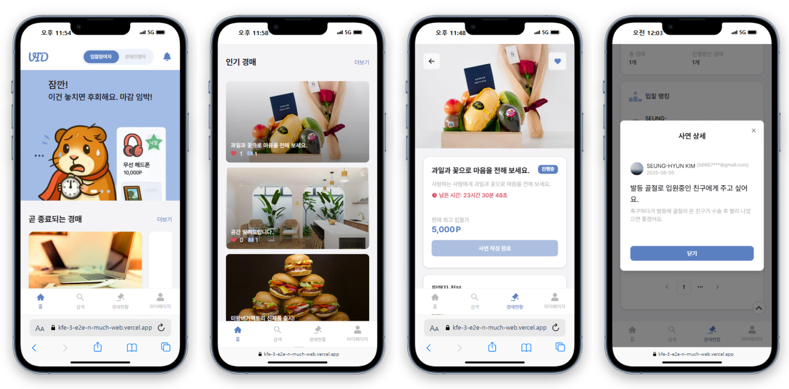

# Vidding

## 배포 정보

- **배포 도메인**: [https://kfe-3-e2e-n-much-web.vercel.app/](https://kfe-3-e2e-n-much-web.vercel.app/)
- **배포 문서 (Storybook)**: [https://n-much-docs.vercel.app](https://n-much-docs.vercel.app/?path=/docs/components-atoms-badge--docs)
- **팀 노션**: [https://www.notion.so/2-n-210a3f519ab880ae8a51d0a23ae905aa](https://www.notion.so/2-n-210a3f519ab880ae8a51d0a23ae905aa)

## 팀원 소개

| 이준구     | 김명환   | 김승현     | 박서영    | 안주원 |
| ---------- | -------- | ---------- | --------- | ------ |
| 팀장       | 팀원     | 팀원       | 팀원      | 팀원   |
| @LeeJunGoo | @baram55 | @kimsh0306 | @seokachu | @joo1e |

## **프로젝트 목표**

- 핵심 기능 구현에 집중하여 완성도 높은 MVP 경매시스템을 개발한다.
- 공통 컴포넌트 개발과 모노레포 구조 도입을 통해 앱 전반에 일관된 사용자 경험과 개발 효율성을 확보한다.
- 푸시 알림과 PWA를 적용하여 모바일 환경에서도 원활한 접근성과 실시간 상호작용을 제공한다.
- 기존 화폐 기반 경매와 차별화된, 스토리와 가치를 중심으로 한 새로운 입찰 경험을 실현한다.

## **프로젝트 소개**

**Vidding**은 전통적인 화폐 경매 방식이 아닌, **사연과 가치 중심의 입찰**을 통해 경매를 진행하는 플랫폼입니다.
테마 기반 경매 이벤트와 스토리텔링 기반의 참여 방식으로 색다른 경험을 제공합니다.

- **프로젝트 주제:**
  - 스토리와 감성, 그리고 가치를 기반으로 한 새로운 형태의 입찰 경매 플랫폼 개발
- **서비스가 추구하는 핵심가치:**
  - "가치(Value)"로 "입찰(Bidding)"하는 신개념 경매
    - 기존의 가격 경쟁이 아닌, 저마다의 스토리가 진짜 가치를 만드는 새로운 경매 방식
  - 사용자의 스토리가 가치를 갖는 감성 중심의 입찰 경험
    - 사연에 대한 공유와 공감이 자연스럽게 이어지며, 커뮤니티로서의 기능도 함께 제공
  - 단순 거래를 넘어, 참여와 소통으로 선순환을 만드는 이벤트 플랫폼
    - 사연이 공유되는 경매 과정을 통해 이벤트 제공자(업체)는 홍보 효과를 얻게 됨
- **서비스의 이용 대상:**
  - 구매자(BUYER): 색다른 참여형 경매 이벤트를 원하는 일반 사용자
  - 판매자(SELLER): 자연스러운 홍보 효과를 얻고자 하는 브랜드 및 기업
- **페르소나**
  - 김소연/30대/여/문화기획사 마케터/서울/작은 감동을 추억하는 걸 좋아함/신제품, 소셜 이벤트에 적극 참여/“내 사연이 선택받는 경매, 궁금하다!”
  - 박민수/20대/남/IT스타트업 기획자/경기/경쟁보단 이야기, 소통이 더 중요하다고 생각/감성적이고 유쾌한 이벤트 선호/“가격 경쟁 대신 가치로 승부!”

### **기획 및 디자인 설계**

- 기획: 경매 플로우에 맞게 핵심 기능 정의 및 기술 선택(기능 정의 명세서, 데이터 모델 명세서, 기술 선택 분석 리포트)
- 디자인: 와이어프레임, 디자인 토큰, 공통 컴포넌트 설계(Figma)

**프로젝트 기간**

- **E2E**: 2025.06.16 ~ 2025.07.04
- **FINAL**: 2025.07.05 ~ 2025.08.06

**개발환경**

- Frontend: Next.js, Tailwind CSS, Shadcn/UI, Zustand, TanStack Query, Storybook
- Backend: Next.js 라우트 핸들러(API)
- DBMS/BAAS: Supabase (Database, 인증 등)
- 모노레포/빌드 관리: Turborepo
- 코드 관리/협업: GitHub, Prettier, ESLint
- 커뮤니케이션: Discord, Zoom
- 기획/디자인: Figma

**사용자 화면**

